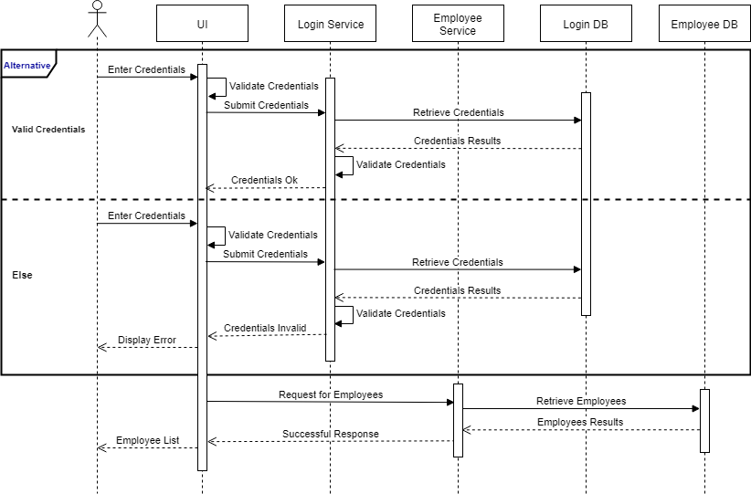

# Full Stack Coding Challenge
The coding challenge was designed to build skills for those seeking a path as a Java Full Stack developer with a cloud native approach. These technologies are not limited too but include Java, Spring Boot, Spring Cloud, Docker, Docker Compose, Kubernetes, Angular and React.  There are eight components (containers) that should be running simultaneously:  

- Two UIs (Angular and React) running in parallel 
- Four Spring Boot Applications
- Two Databases (SQL or NoSQL).  

# Before You Get Started
1. Install [JDK 1.8](https://www.oracle.com/java/technologies/javase/javase-jdk8-downloads.html) or later.  &nbsp;JDK 1.8 is recommended for the challenge.
2. Install [Node JS](https://nodejs.org/en/download/)
3. Install [Docker Desktop](https://www.docker.com/products/docker-desktop)
4. Preferred IDEs.  However, feel free to use the IDE of your liking.
    * Install [Spring Tool Suite (STS)](https://spring.io/tools) for Java.
    * Install [Visual Studio Code](https://code.visualstudio.com/download)
5. Create a [Docker Hub Account](https://hub.docker.com/)
6. Create an account with a Cloud Provider of your choice.
7. Create a [GitHub Account](https://github.com/) 
8. If you are not familiar with Git commands, feel free to find an online training tutorial or enroll in the [Udemy Course - Git for Geeks](https://ibm-learning.udemy.com/course/git-for-geeks/).

# Projects in this Repository

|Projects                 |Description                                          |
|-------------------------|-----------------------------------------------------|
|angular-ui               |`Angular UI Project`                                 |
|api-gateway              |`Spring Boot Zuul API Gateway Service`               |
|discovery-service        |`Spring Boot Eureka Discovery Service`               |
|employee-db-docker-image |`Contains Dockerfile for building MySQL Employee DB` |
|employee-service         |`Spring Boot Employee Service`                       |
|login-db-docker-image    |`Contains Dockerfile for building MySQL Login DB`    |
|login-service            |`Spring Boot Login Service`                          |
|registration-service     |`Spring Boot Employee Registration `                 |
|react-ui                 |`React UI`                                           |

# Sequence Diagrams

## Login
> #
> 
> #

## Add and Edit Employees
> #
> 
> #
